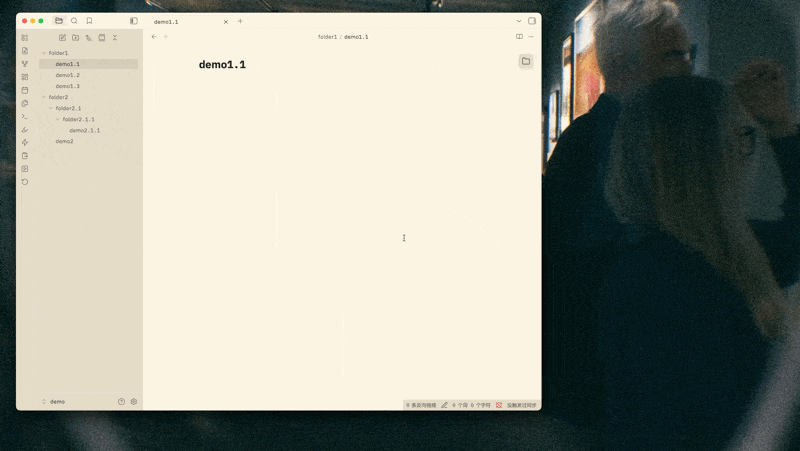

# Floating Explorer - Obsidian Plugin

An Obsidian plugin that displays a floating folder browser icon in the top-right corner of each page.

## Features

- Floating folder icon in the top-right corner of each page
- Hover to display complete folder structure
- Collapsible/expandable tree-style file browser
- Seamlessly integrates with Obsidian theme styles
- Quick file opening with a single click
- Focus mode: Right-click on any folder to focus on that folder only
- Per-pane state: Each editor pane maintains its own explorer state

## demo



## Installation

### Quick Installation (Recommended)

Simply copy these three files to your Obsidian vault's plugin directory:

- `main.js` (pre-compiled, ready to use)
- `manifest.json`
- `styles.css`

**Steps:**

1. Copy the plugin folder to:

   ```
   <your-vault>/.obsidian/plugins/obsidian-floating-explorer/
   ```
2. In Obsidian:

   - Open Settings → Community Plugins
   - Disable Safe Mode (if not already disabled)
   - Refresh the plugin list
   - Find "Floating Explorer" and enable it

### Build from Source (For Development Only)

Only needed if you want to modify the TypeScript source code (`main.ts`):

```bash
npm install
npm run build
```

This compiles `main.ts` into `main.js`.

## Usage

1. After enabling the plugin, you'll see a floating folder icon in the top-right corner of each page
2. Hover over the icon to display the complete folder structure
3. Click the arrow before a folder name to expand/collapse it
4. Click a file name to open the file
5. The panel will automatically hide when the mouse moves away
6. Right-click on any folder to enter Focus Mode for that folder
7. Click the back arrow at the top to exit Focus Mode

## Development

```bash
# Install dependencies
npm install

# Development mode (auto-rebuild)
npm run dev

# Production build
npm run build
```

## Tech Stack

- TypeScript
- Obsidian API
- esbuild

## License

MIT

## Feedback

If you have any issues or suggestions, feel free to submit an issue.
